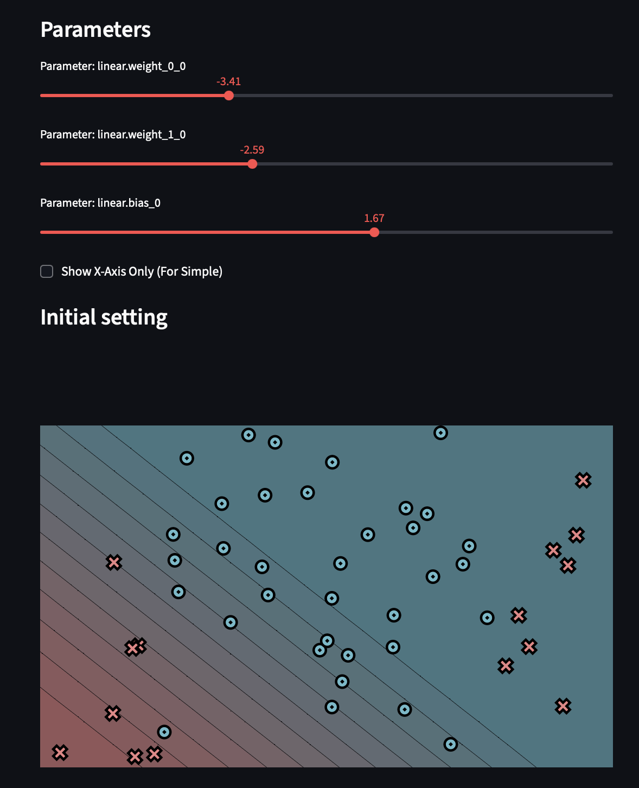

# MiniTorch Module 0

* Docs: https://minitorch.github.io/

* Overview: https://minitorch.github.io/module0/module0/

## Task 0.5

Simple Dataset

Diag Dataset

Split Dataset

XOR Dataset

Circle Dataset

Spiral Dataset

